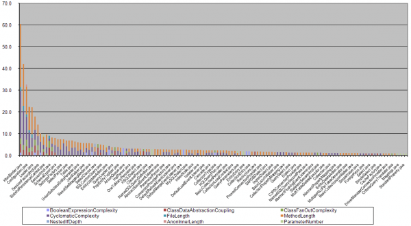

# toxicity [](https://travis-ci.org/josephearl/toxicity)

Build plugins, a CLI and libraries for measuring and communicating code quality using toxicity scores and charts. 

**This project is under development and as such the API and feature-set is subject to change. Java is currently the only supported language and jars are not yet available on Maven Central or Bintray.**

[Toxicity charts](http://erik.doernenburg.com/2008/11/how-toxic-is-your-code/) are a simple and effective way to communicate code quality (or perhaps lack of it) to other human beings.
A Toxicity chart is a vertical bar chart where each bar represents a file and the height of the bar is proportional to the toxicity score.



The toxicity score is based on code quality metrics and thresholds:

> For example, the method length metric has a threshold of 30. If a class contains a method that is longer it gets points proportional to the length of the method in relation to the threshold, e.g. a method with 45 lines of code would get 1.5 points because its length is 1.5 times the threshold. The score for all elements is added up. So, if a class comprises two methods, one that is 45 lines and another that is 60 lines long, the method length component of the score for the class will be 3.5 points. This means that elements are not just classified as toxic but the score reflects how toxic the element is.

— *Erik Dörnenburg*, [How toxic is your code?](http://erik.doernenburg.com/2008/11/how-toxic-is-your-code/)

## Generating toxicity reports

The build plugins can be used to easily generate toxicity reports from your projects code.

Alternatively with the CLI you can generate toxicity reports from metrics files generated by other code quality tools such as Checkstyle or ESLint.

Or roll your own tools and plugins using the library and the reader and writer plugins.

**Build plugins**

* gradle-toxicity - `uk.co.josephearl:gradle-toxicity`

To use the Gradle plugin first build the project (see Developing toxicity) then add a classpath dependency on the plugin to your `build.gradle`:

```groovy
buildscript {
    dependencies {
        classpath 'uk.co.josephearl:gradle-toxicity:X.Y.Z'
    }
}
```

Then apply the plugin with your chosen report options:

```groovy
apply plugin: 'uk.co.josephearl.gradle.toxicity'

tasks.withType(uk.co.josephearl.gradle.toxicity.Toxicity) {
  reports {
    csv.enabled false
    html.enabled true
  }
}
```

Run the `toxicity` task to generate reports:
```
./gradlew toxicity
```

**CLI**

* toxicity-cli - `uk.co.josephearl.toxicity:toxicity-cli`

To use the CLI directly build the project (see Developing toxicity) and execute:

```
java -jar toxicity-cli.jar \
  thresholds.xml --thresholds-format checkstyle \
  metrics.xml --metrics-format checkstyle \
  toxicities.csv --toxicities-format csv
```

**Library**

* toxicity - `uk.co.josephearl.toxicity:toxicity`

**Readers and reporters**

* metrics-readers:
    * checkstyle - `uk.co.josephearl.toxicity:metrics-reader-checkstyle`
* thresholds-readers:
    * checkstyle - `uk.co.josephearl.toxicity:thresholds-reader-checkstyle`
    * eslint - `uk.co.josephearl.toxicity:thresholds-reader-eslint`
* toxicities-reporters:
    * csv - `uk.co.josephearl.toxicity:toxicities-createWriter-csv`
    * html - `uk.co.josephearl.toxicity:toxicities-createWriter-html`

**Standard thresholds**

A set of standard thresholds are provided for use with the metrics output from common tools code quality tools. These also provide configuration files that can be used with the tool to gather metrics correctly.

* checkstyle - `uk.co.josephearl.toxicity:thresholds-checkstyle`
* eslint - `uk.co.josephearl.toxicity:thresholds-eslint`

## Developing toxicity

To build everything and run all tests, publish the gradle plugin locally and run the gradle plugin on toxicity and toxicity-cli:

```
./gradlew publishToMavenLocal build
```

## TODO

**Development**

* Consider introducing more interfaces
* Java 7 support
* CLI should support arbitrary readers and writers using classpath
* Add option to keep Checkstyle report to Gradle plugin
* Add threshold and allowFailures options to Gradle plugin
* Consider introducing builders for constructing immutable types
* Improve test coverage
* Use React for HTML chart
* Support C#/MSBuild with dotnet core
* Re-use HTML report across languages
* Cross-language acceptance tests for CLI
* Var args??? (what did I mean by this? constructor or method?)
* Document how to calculate toxicities from arbitrary code quality tools
* Additional information in toxicities output like averages and thresholds
* Defined JSON formats for data structures and readers/writers for easy interoperability between lanuages
* Support for more packaging formats for CLI like Docker, Brew
* Support for more languages like JavaScript, Scala, Ruby, Python or Go

**Research**

* Toxicity graphs for popular projects in JS, Java, Scala, Ruby etc
* Comparison of toxicity to repos of same language
* Comparison of toxicity to languages
* Comparison of toxicity to other quality measures
* Comparison of toxicity to coverage, development methodologies, team size/experience etc

## Related projects

* [softvis/toxicity-reloaded](https://github.com/softvis/toxicity-reloaded) - HTML toxicity chart
* [katta/toxicity](https://github.com/katta/toxicity) - Java based tool for calculating toxicity from Checkstyle reports
* [AdamNowotny/toxicity-charts](https://github.com/AdamNowotny/toxicity-charts) - Toxicity charts for .NET code
* [halvards/toxicity-dotnet](https://github.com/halvards/toxicity-dotnet) - C# based toxicity score calculator
